# Whack-a-Mario
View the live site here

# Table of Contents
1. [Introduction](#introduction)
2. [UX](#ux)
    * [Project Goals](#project-goals)
    * [User Goals](#user-goals)
    * [User Stories](#user-stories)
    * [Design](#design)
    * [Wireframes](#wireframes)
3. [Technologies Used](#technologies-used)
4. [Features](#features)
5. [Features To Add](#features-to-add)
6. [Testing](#testing)
7. [Bugs](#bugs)
8. [Validator Testing](#validator-testing)
9. [Deployment](#deployment)
10. [Credits](#credits)
    * [Content](#content)
    * [Media (Images)](#media)
    * [Acknowledgements](#acknowledgements)

# Introduction
[Visit the live site here]()
Whack-A-Mole is an arcade game from the 1970's where a player used a mallet to hit the moles as they randomly popped out of holes, to score points. I used to play Super Mario as a kid, and have seen some abreviations of Whack-A-Mole with Whack-A-Mario so I thought this would be a super fun take on the old game!

This game does not requre lots of reading to interact and play. This game inlcudes game instructions which are short and easy to follow. The game is contained in one page, so it is easily accessible and allows the target audience to interact immediately without having to follow the instructions or navigate away from varied pages to access their game play. 

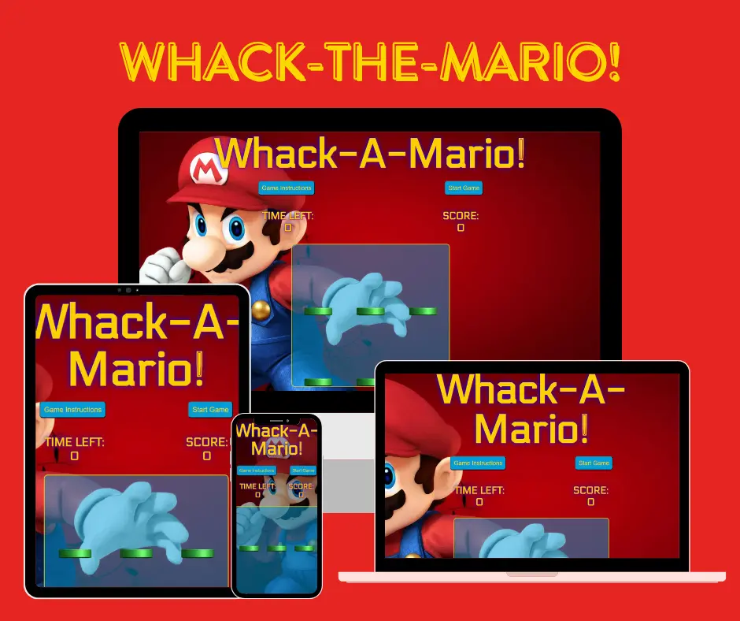

# UX
### Project Goals
Whack-a-Mario is a game designed to give the user a fun, intuitive and interesting game where the time the mario pops up is completely random!

### User Goals
* Easy to understand and play as soon as the user lands on the game site
* Sounds responsive to actions (if they hit a mario)

### User Stories
#### As a first time visitor I want to quickly understand where to find the rules
* The user can easily see the button 'Game Instructions'
* When hovering the button changes background-color to indicate the user can click on it.
#### As a first time visitor I want to know where to start the game
* As soon as the page is loaded the user can easily see the button 'Start Game'
* When hovering above the button changes background-color to indicate the user can click on it
#### As a first time visitor I want to see what my score is and how much time I have left
* Above the game container the user can see their score and the time they have left.
* The information is updated in real time so the user always sees how they are doing, with score and time left
#### As a returning visitor I want to be able to quickly restart the game when it's over
* There is a pop up that will display the score the user achieved on game over and a button to play again
#### As creator I want to provide the users with a game that is simple to navigate
* When the website loads the users are clearly presented with the name of the game, a game-info area, a game-area and a control-area.
* When hovering above buttons the background color changes to indicate even further that the user can click on them
#### As a administrator I want to provide a design and feedback that is fun and engages with the user
* The game is designed to be "cartoonish" so the user clearly can see that it is a game and not made to be realistic.
* When the game is ended the user are presented with their score and an opportunity to play again

### Design
#### Colors
Based on mario, so I've chosen a mario color pallete from [Pinterest](https://www.pinterest.ie/pin/644366659198278801/). 

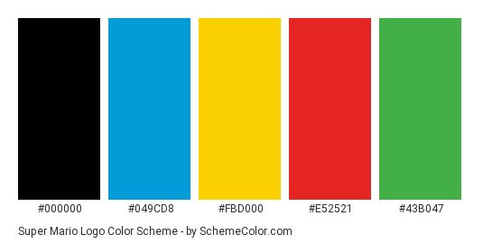

#### Font
* The font used in the project is Electrolize from [Google Fonts](https://www.fonts.google.com). It was chosen because of it's retro/game look and feel.

#### Background Image
* The background image was taken from a free wallpaper download of [Mario Images](https://mrwallpaper.com/wallpapers/download-mario-wallpaper-nggsnupoh0ha4car.html)

#### Audio
* The 'whack' audio was taken from pixabays free sound effects downloader. [Pixabay](https://pixabay.com/sound-effects/)

#### Wireframes
* To create the general idea of the site [Figma](https://www.figma.com/files/recents-and-sharing?fuid=1312036834940135231) was used to create the wireframes. I had a pretty good idea of the colours, and how I wanted the game to look prior to even starting the project. 
* Desktop View
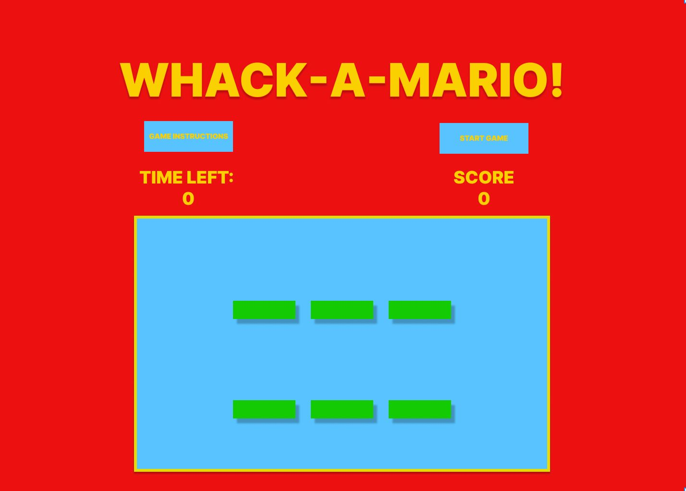

* Mobile View
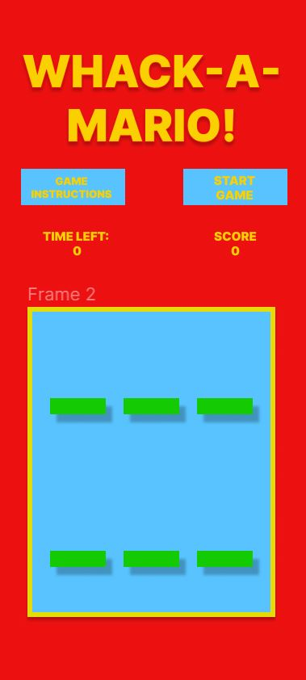

# Technologies Used
This project was built using HTML, CSS and Javascript.

* [Google Fonts](https://fonts.google.com/)
    * Used to style the text
* [Gitpod](https://gitpod.io/) 
    * Gitpod was used by the developer to build the game.

* [GitHub](github.com/dashboard)
    * GitHub was used to store project code.

* [Figma](https://www.figma.com/)
    * Figma was used to create the wireframes

* [Google Chrome Developer Tools](https://developer.chrome.com/docs/devtools/overview/) 
    * was used during the whole project, especially while debugging and making it responsive for different screen-sizes.

* [Google Chrome Lighthouse](https://developers.google.com/web/tools/lighthouse) 
    * was used when testing the site performance.

* [Am I Responsive](https://ui.dev/amiresponsive?url=https://jaxsonkieran.github.io/whack-the-mario/)
    * was used to give the reader a quick and easy way to see the responsiveness of the site. 

* [Favicons](https://favicon.io/) was used to add a favicon to the browser.
 
* [W3C HTML Validator](https://validator.w3.org/) 
    * was used to check for errors in the HTML code. 

* [W3C CSS Validator](https://jigsaw.w3.org/css-validator/) was used to check for errors in the CSS code.

* [JSHint Javascript Validator](https://jshint.com/) 
    * was used to check for errors in the JavaScript code.

# Features
* There will be two buttons located at the top of the page, an About and Play Game.
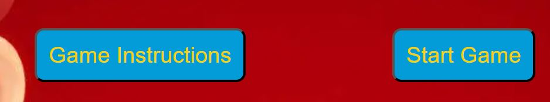

1. As this game was designed to be on one page it was decided to use an About Button for the user to interact with if they need to understand how to play the game.

2. About Modal Box
* On click, the modal box opens with instructions on how to play. The background darkened to cover the game area. 
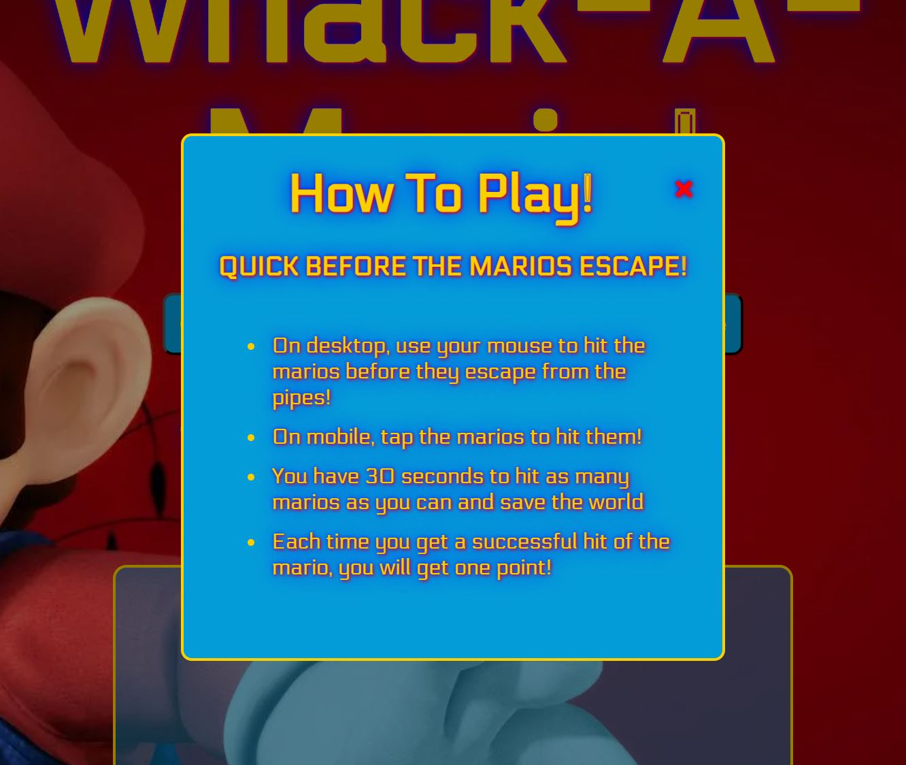
* This includes a hover state to let the user know they are hovering over it and it can be pressed.
* The instructions are fun, small and easy to understand. 
* The X to close the modal box changes colour on hover and located on the top right of the box.
3. Play Game Button
* This button is also located at the top of the page, alongside the about button.
* This includes a hover state to let the user know they are hovering over it and it can be pressed.
* This will launch the game into action.
* The button is deactivated during in-game play and reactivated once finished.
4. Timer

* The timer is displayed as Time Left:, it will count down from 20 seconds. 
5. Scoreboard
* The score is displayed at the top of the game area. 
* Successful hits of the super marios will move the score up 1 point. At the end of the game, you will see your final score.
* There is a game over popup when the time runs out, the popup will appear to tell the user the game is over and their score. It will also present a play again button. 
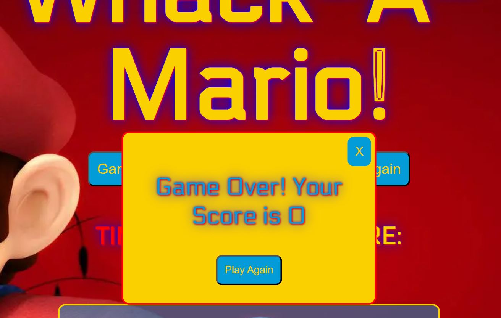

* Backdrop, Marios & Holes
    * A scary looking mario about to attacked was chosen for the background of the game, it fits the design and looks fun!
    * I added the top of the green mario pipes that you see in the mario games as a fun unqiue way to show that's what they are popping up out of.
    * As the game starts the marios pop up out of random holes at completely random times. 
    * The mario was taken from pixabay again from a stock image source. Again, with the arm raised, it fit the game perfectly and looks like he's actually jumping up out of the pipe!
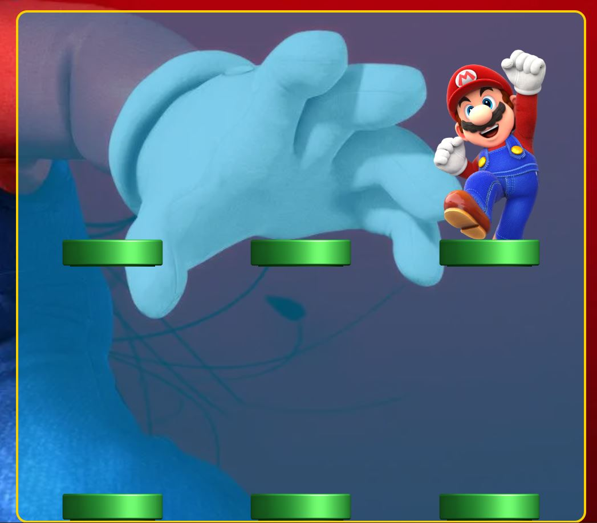

* Favicon
    * A favicon was generated by uploading a mario image to the logo to [Favicon Generator](https://realfavicongenerator.net/). This then generated an icon that was saved in the assets images folder and linked in the head section of the html.
    * A favicon consistent with the theme of whack-a-mario was chosen to be associated with this website for extra visual support for the user.

# Features to Add
* I would really like to add levels to this game, increase the difficulty and make it more difficult for the user as they progress.
* It would also be cool to add a changing game container if the user passed a certain level, like if they hit over 20 marios, the game would change and they would need to hit moles, or pokemons, something to keep the user more engaged!
* I would also like to add a scoreboard, created with highscores fromd different players

# Testing
* Clicking, hovering and extensive use of the Chrome Developer Tools were used during this project's development to test for bugs in the HTML, CSS and JS Code. The elements section was used for the HTML & CSS. The console was used to check the JS. Use of console.log() and for click events alert() were used as the code was written to help check for everything.
* After deployment to GitHub I checked the site on mobile, Apple, Samsung, Laptops and Desktops. TO ensure all features functioned correctly and responsiveness worked. 
* All buttons were tested to ensure the hover states worked. 
* The audio control was tested too to ensure it worked on desktop and mobile when the mario was hit. 
* Time Left indicator was checked that it started at 20 before the game started and counted down to 0. 
* The scoreboard was tested to ensure that on each correct hit of the mario it added 1. Also, tested to ensure the score reset back to 0 when Play Again was selected. 

# Bugs
* One of the more major bugs I encountered when making this project was trying to change the cursor to a hammer, or mallet when the user brought their mouse over the game container. I tried creating it in JS, CSS, etc. to no avail.
* I had a lot of trouble with getting the mario to slide up and appear behind the pipe. I had to resort to cropping the bottom of the green pipe altogether and making it look like it was in the ground so it looked like the mario was jumping up out of it. I think it still looks ok in the end. 
* Another bug that popped up while testing, I added a window.click event listener to the game over popup but it meant people were clicking out of it before they saw the final score. This meant I had to remove this part in the javascript code and update it to create a close button element instead which worked out better in the end. 

# Validator Testing
* Before testing, code was checked and formatted by right clicking an choosing - format document.

* The [W3C](https://validator.w3.org/nu/#textarea) site was used to validate the HTML code. 
It returned no errors as shown below. 
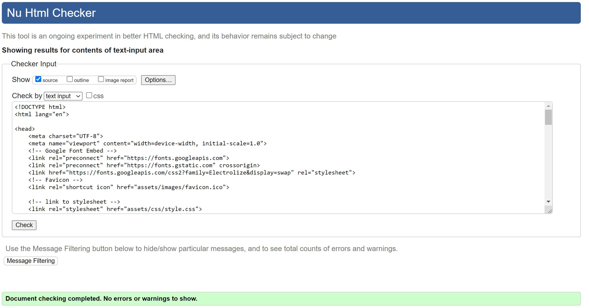

* The [W3C](https://jigsaw.w3.org/css-validator/validator) was also used to validate the CSS code. It returned no errors also.
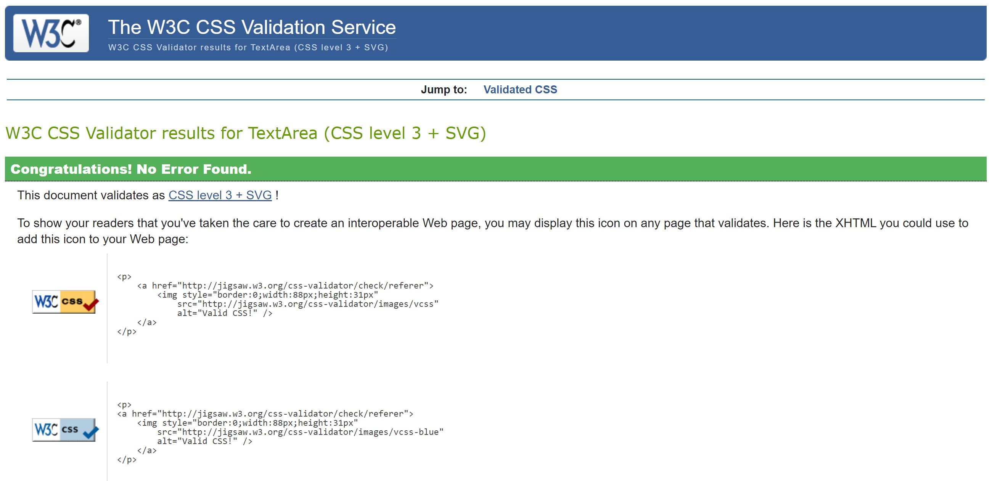

* [JSHINT](https://jshint.com/) was used to validate the JavaScript code. It returned no erros. Shown below.
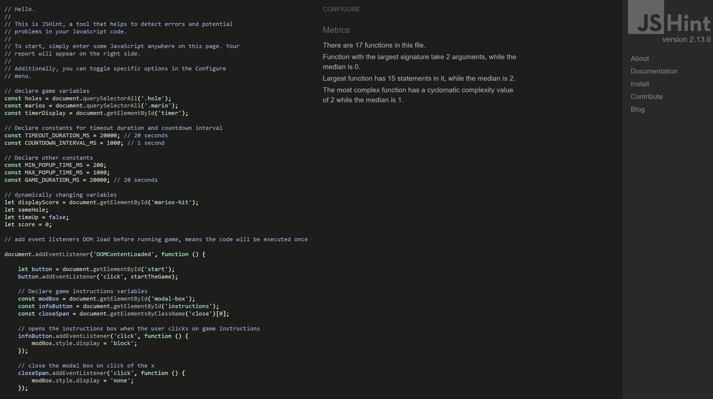

* Lighthouse was used to check the site performance, accessibility, best practice and SEO. 
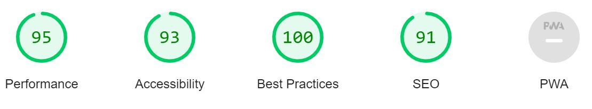

* Responsiveness
Pages were testing using the [amiresponsive](https://ui.dev/amiresponsive?url=https://jaxsonkieran.github.io/whack-the-mario/) website. Where it is possible to see the site on different screen sizes. 

# Deployment
This project was developed using [Gidpod](https://gitpod.io/), and pushed to [GitHub](https://github.com/).

To deploy Whack-A-Mario to GitHub Pages from its [repo](https://github.com/jaxsonkieran/whack-the-mario.git) these are the steps to take.

1. Log in to GitHub.
2. From the list of repos choose **jaxsonkieran/whack-the-mario**
3. Near the top of the page there will be the menu items, click on **Settings**
4. On the left side of the screen there is another list of items.
5. Scroll down to the second last item which will be **Pages** and select it.
6. Under **Source** click the dropdown menu and select **Master**
7. Once selected the link will appear in a matter of seconds to the live site.

### How to run this project locally

To clone this project:

1. Click this link to the [Whack-a-Mario](https://github.com/jaxsonkieran/whack-the-mario.git) repo.
2. Under the menu items, there is a green button labelled **Code**.
3. Click the **Code** button and under the **Clone** option select the **HTTPS** tab.
4. Copy the clone URL for the repo.
5. In Your IDE open Git
6. Change the current directory to the location you want to clone this repo.
7. Type **git clone** followed by the copied URL.
8. Press Enter and your clone will be created.

# Credits
## Content
* Some really helpful tutorials I used to help me with coding some of the design ideas for this project. I really benefitted from utilising the information from Code Institute and supplementing with Colt Steele Web Developer Course on Udemy, Javascript 30/30 challenges and Ania Kubow.
    * [Javascript Whack-A-Mole](https://www.youtube.com/watch?v=toNFfAaWghU&feature=youtu.be)
    * [Ania Kubow Whack-A-Mole](https://www.youtube.com/watch?v=rJU3tHLgb_c&feature=youtu.be)

* Some other helpful resources that helped me learn to impliment specific features.
    * W3Schools - [How to make a modal](https://www.w3schools.com/howto/howto_css_modals.asp)
    * [CSS Tricks](https://css-tricks.com/)

* Stack Overflow was also used for certain Javascript methods and iterating over objects, etc. Just to back up my code to make sure I was heading in the right direction.

## Media
* The images were chosen from [Pixabay](www.pixabay.com) 

# Acknowledgements 
* My peers on slack at the Code Institute have been extremely helpful with my project. The advice and support from Code Institute tutors were also super helpful in the early stages when I was running into issues with my GitPod, as this was my third iteration of the project. I had to restart a number of times. 